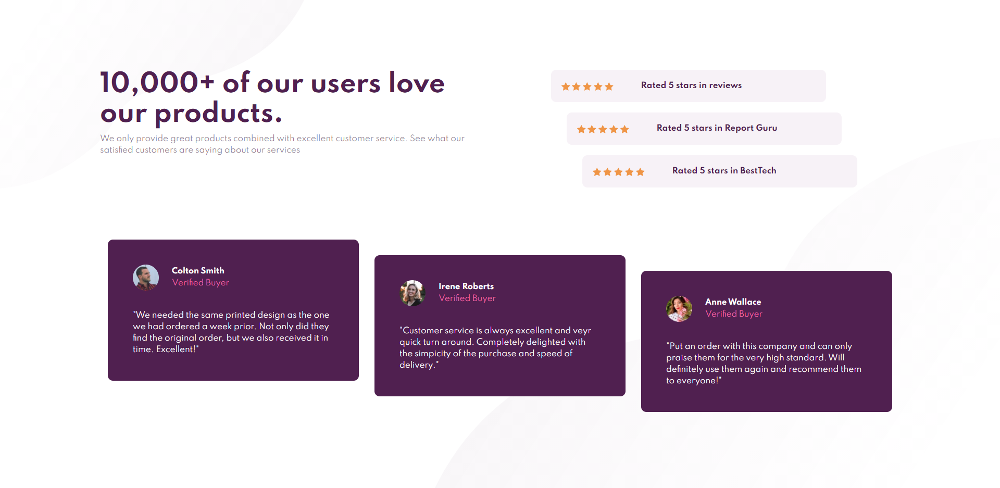

# Frontend Mentor - Social proof section solution

This is a solution to the [Social proof section challenge on Frontend Mentor](https://www.frontendmentor.io/challenges/social-proof-section-6e0qTv_bA). Frontend Mentor challenges help you improve your coding skills by building realistic projects. 

## Table of contents

- [Overview](#overview)
  - [The challenge](#the-challenge)
  - [Screenshot](#screenshot)
  - [Links](#links)
- [My process](#my-process)
  - [Built with](#built-with)
  - [What I learned](#what-i-learned)
  - [Continued development](#continued-development)
- [Author](#author)

## Overview

### The challenge

Users should be able to:

- Recreate the social proof section according to the design specifications as accurately as possible.

### Screenshot

### Links

- Project URL: https://www.frontendmentor.io/challenges/social-proof-section-6e0qTv_bA
- Live Site URL: https://aidenm99.github.io/Responsive-Social-Proof-Section/

## My process
To begin, I laid out all of the code that I would need in HTML and then allocated everything to their respective divs. I then placed the elements in their rough 
positions and began styling.

### Built with

- Semantic HTML5 markup
- CSS custom properties
- Flexbox
- Bootstrap 4

### What I learned
- I learned how to better utilise bootstrap to create a responsive webpage and achieve my desired layout. I also learned how to use media queries.

### Continued development
-I plan to learn how to utilise grid within Bootstrap to be able to more easily lay out my webpages.

## Author

- Frontend Mentor - [@AidenM99](https://www.frontendmentor.io/profile/AidenM99)

